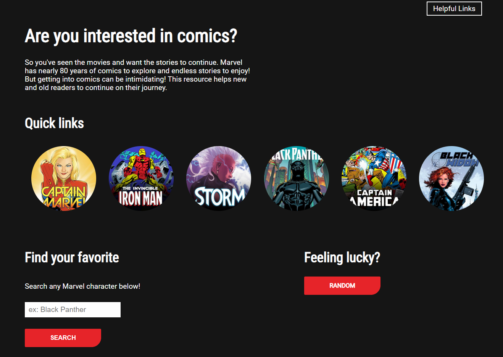
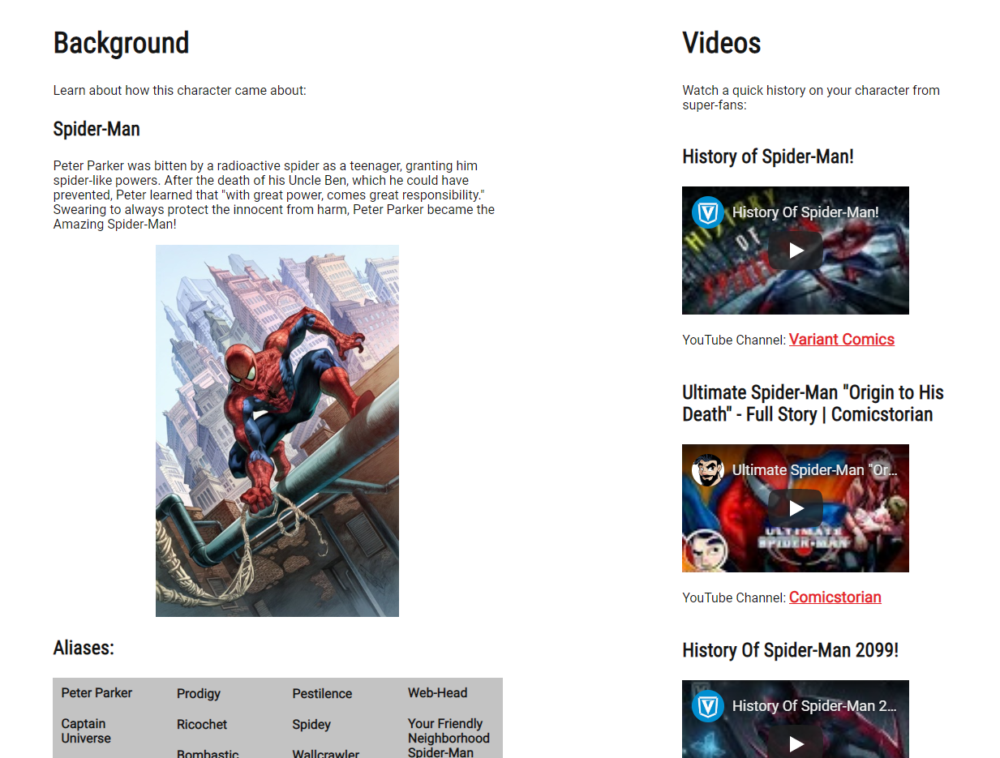

# Marvel Comics Finder
Are you a fan of the Marvel movies but intimidated by the comics? This project is designed for users to search for their favorite characters and find right where to start.

## Motivation
I wanted to help people who are inspired by the Marvel superhero movies and want to get into comics. However, there are almost 80 years of backstory to get through! This site hopes to simplify the process and give users access to all the information they need. 

## Demo
- [Live Demo](https://khoerch.github.io/marvel-comics/)

## Screenshots 
Landing Page: 

Search Results: 

## Environment Setup
A few notes on the environment needed to run this site. The Marvel Comics API requires an API key and restricts access to their API to user-defined websites in your developer account. This makes testing and building the site as a local file difficult. I recommend using a site like repl.it to test any feature requiring the Marvel API, then incorporating them into the greater document.

## Built With
* jQuery
* Javascript
* HTML
* CSS

## Features
* Search for a character from Marvel's database
* Pick a random or preset character
* Get their origin story and aliases from Comicvine.com
* Return YouTube videos that give a history of the characters
* See covers and links to comics that serve as jumping off points for the characters

## Authors
* Kevin Hoercher